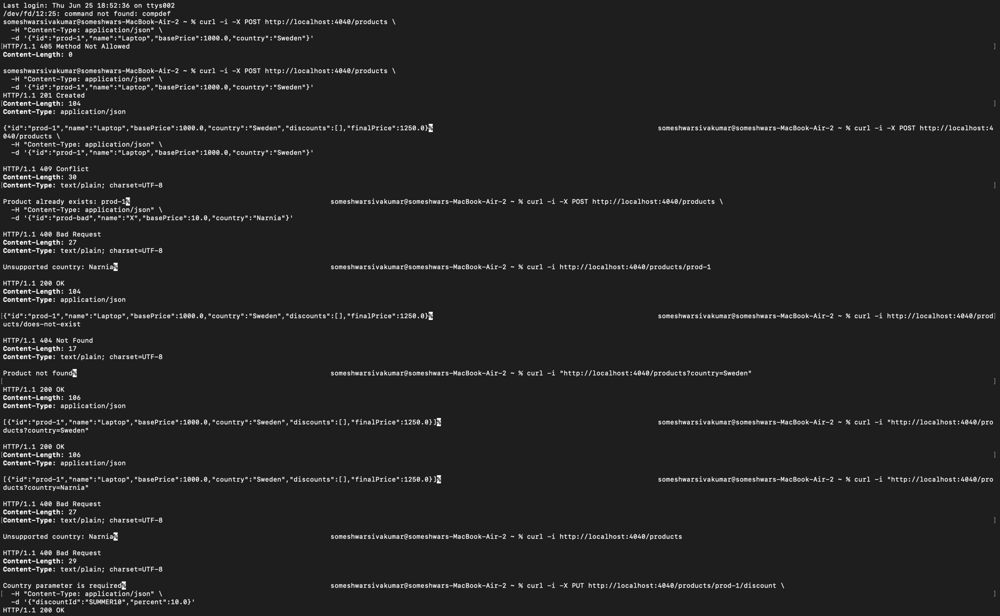
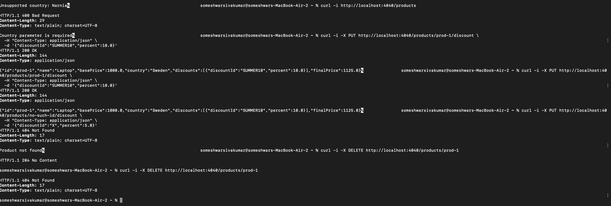

# FIXES.md

Went through the failing tests one by one and dug into why each one was actually broken (not
just patching the assertion). Here's what I found, in the order I tackled them.

## 1. JSON never actually got serialized

The server was missing the `ContentNegotiation` plugin entirely, so `GET /products` couldn't
turn the response into JSON and `PUT /products/{id}/discount` couldn't read the request body —
hence the `SerializationException`s in the HTTP tests. Added:

```kotlin
install(ContentNegotiation) {
    json()
}
```

in `Application.module()`. The dependencies were already in `libs.versions.toml`, they just
were never wired up.

That fixed it partway, but the same exception kept showing up. Turned out there's a second,
sneakier problem: the Kotlin serialization *compiler* plugin (`org.jetbrains.kotlin.plugin.serialization`)
was never applied in `build.gradle.kts` — only the runtime library was on the classpath. Without
the compiler plugin, `@Serializable` classes like `Product` and `ApplyDiscountRequest` don't get
a generated serializer, so any attempt to (de)serialize them blows up deep inside the
kotlinx.serialization library (you'll see it as `Platform.common.kt:90` in the stack trace, which
isn't our code at all). Added the plugin alias and applied it:

```kotlin
// app/build.gradle.kts
plugins {
    alias(libs.plugins.kotlin.jvm)
    alias(libs.plugins.kotlin.serialization)
    application
}
```

## 2. Discounts were stacking the wrong way

`calculateFinalPrice()` was adding up discount percentages and applying them as one combined
discount (`sumOf { it.percent / 100.0 }`). That's wrong — discounts should compound. 10% off then
20% off should leave you with `0.9 × 0.8 = 72%` of the price, not `1 - (0.10 + 0.20) = 70%`. Small
difference on paper, but it's exactly why the "multiple discounts" test was failing by a few
dollars. Swapped the sum for a fold that multiplies the price down step by step, then applies VAT
once at the end.

## 3. The actual concurrency bug

This is the one the README calls out as critical, and it's the most interesting bug in here.
`ProductRepository.applyDiscount` was doing a find → check if discount already exists → save.
That's not atomic. Two requests can both read the product before either one writes, both decide
"yep, discount's not there yet, I'll add it," and then race each other on the write — whoever
saves last wins and the other one's change just disappears. That's a lost update, and it's why
the concurrent test sometimes ended up with fewer than 26 discounts instead of exactly 26.

(Side note: there was a `delay(5)` in there labeled as a "throttle to prevent MongoDB write
overload." It wasn't doing that — if anything it just made the race window wider and the bug
easier to hit.)

Fixed it by pushing the whole check-and-write down into a single atomic Mongo operation instead
of doing it in application code:

```kotlin
val filter = Filters.and(
    Filters.eq("id", productId),
    Filters.not(Filters.elemMatch("discounts", Filters.eq("discountId", discount.discountId)))
)
collection.updateOne(filter, Updates.push("discounts", discount))
```

This only pushes the discount onto the array if the product exists *and* doesn't already have
that discountId. Mongo guarantees the match-and-modify happens atomically, so however many
requests hit this at once, the discount can only get added once. As a nice side effect this also
gives us idempotency for free — a repeat call just matches nothing and does nothing.

While I was in there I also changed `save()` to do an atomic upsert (`replaceOne` with
`upsert = true`) instead of its own separate find-then-insert-or-replace, since that had a
smaller version of the same race.

## 4. Unsupported countries were quietly charged 0% VAT

README calls this one out directly - "the system should properly validate and handle requests
for countries not in this table." `VatConfig.getVatRate` was just returning `0.0` for anything
not in the map, and there was a test asserting that's fine. Problem is that means a typo or a new
market we haven't configured yet just gets 0% VAT with no warning, which isn't really a "default,"
it's just silently wrong.

This changes API behavior so I ran it by the project owner first - decision was to reject
unsupported countries outright instead of letting them through. So:

- `VatConfig.getVatRate` now throws `UnsupportedCountryException` instead of defaulting to 0.
  Also added `VatConfig.isSupported(country)` for places that just want a boolean check.
- `ProductService.getProductsByCountry` checks the country up front and throws for unsupported
  ones.
- Both `GET /products` and `PUT /products/{id}/discount` in `Application.kt` catch that exception
  and turn it into a 400.
- Updated the test that encoded the old behavior — `should handle products from unknown
  countries` became `should reject requests for unsupported countries`, now asserting the
  exception gets thrown. Also added an HTTP-level test for the same thing.

## 5. One test was testing two different things by accident

`should return empty list for country with no products` used `"NonExistentCountry"` as its
example — but that's actually an *unsupported* country, not a *supported country that just has no
products in it yet*. Those are genuinely different cases, and once fix #4 landed, this test broke
because it started throwing `UnsupportedCountryException` instead of returning an empty list.
Swapped it to query `"Sweden"` instead (supported, just nothing saved for it), so it's actually
testing what its name says. The unsupported-country case is now covered separately.

## 6. Added a couple of extra endpoints for manual testing

The spec only requires `GET /products` and `PUT /products/{id}/discount`. There's no endpoint
to actually create a product, which made manual testing annoying - the only way to get data in
was seeding Mongo by hand. So I added a small `POST /products` (create), `GET /products/{id}`
(fetch one), and `DELETE /products/{id}` for cleanup. These aren't part of the required API,
just scaffolding so I could drive the app end-to-end with curl. `POST /products` runs through
the same country validation as everything else, so it'll 400 on an unsupported country too.

## Notes

Hit a snag early on getting the test suite running locally (Docker wasn't up, so Testcontainers
had nothing to talk to) - got that sorted and ran the full suite afterward to confirm everything
passes. Screenshots below.

**Test run:**
Please find the test case execution:



